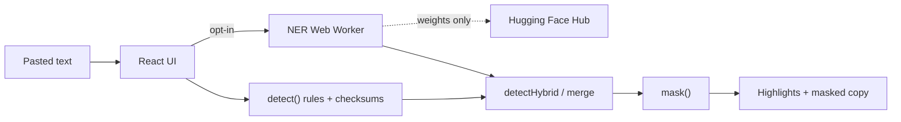

# Client-side PII redactor for Ukrainian text

[](https://github.com/HIST-VR/Client-side-PII-redactor/actions/workflows/ci.yml)

Detects and masks personal data in Ukrainian (and mixed UA/RU/EN) text **entirely in the browser**. No backend. Pasted text is never sent over the network.

**Live demo:** [hist-vr.github.io/Client-side-PII-redactor](https://hist-vr.github.io/Client-side-PII-redactor/)

> **Українською.** Браузерний редактор персональних даних: IBAN, картки, РНОКПП, ЄДРПОУ, УНЗР, телефони, паспорти, пошта, імена та адреси. Правила спрацьовують одразу; українська NER-модель (~110 МБ з Hugging Face Hub) підвантажується за згодою і крутиться у Web Worker. Текст не покидає вкладку. Це зниження ризику, не сертифікований засіб відповідності.

## Architecture



| Package | Role |
| --- | --- |
| `@ua-pii/core` | Detectors, validators, merge, mask, in-process NER |
| `@ua-pii/web` | Vite + React demo, worker, CSP |
| `@ua-pii/eval` | Synthetic corpus generator and P/R/F1 CLI |

Rules cover identifiers that have a checksum or a distinctive pattern. [`onnx-community/uk-ner-ONNX`](https://huggingface.co/onnx-community/uk-ner-ONNX) (XLM-RoBERTa-Uk, int8 ≈ 110 MB) supplies `PERSON` and location spans. `ORG` is dropped. Inference is local; the only network use is downloading model files.

## Data

**Synthetic only.** `datasets/corpus.jsonl` is generated or handwritten with fake names and format-valid identifiers (NBU-style IBANs, Stripe test PANs, Wikipedia/python-stdnum checksum vectors). Do not add live customer text.

- 280 documents, stable 20% held-out (`hash(id) % 5 === 0`)
- Gold is **true PII**, including `PERSON`, not “what the rules can find”
- Invalid checksums are negatives (present in the text, no gold span)
- Spans are JavaScript UTF-16 indices

## Held-out metrics

53 documents, 99 gold spans. Numbers were not used to tune rules or the NER threshold. Full tables: [`docs/baseline.md`](docs/baseline.md). Failures: [`docs/error-analysis.md`](docs/error-analysis.md). Demo page: `#/metrics`.

| Layer | P | R | F1 | tp | fp | fn |
| --- | ---: | ---: | ---: | ---: | ---: | ---: |
| rules | 0.974 | 0.768 | 0.859 | 76 | 2 | 23 |
| model | 0.850 | 0.172 | 0.286 | 17 | 3 | 82 |
| **hybrid** | **0.959** | **0.939** | **0.949** | 93 | 4 | 6 |

Hybrid PERSON F1 **0.944** (17/19 names, 0 FP). IBAN, CARD, RNOKPP, EDRPOU, UNZR, PHONE, EMAIL are exact. ADDRESS F1 drops vs rules because model `LOC` adds cities while gold marks streets.

```
npm test
npm run typecheck
npm run dev
npm run eval -- --layer hybrid --split heldout
npm run check-baseline
```

The first `--layer model|hybrid` run (and the demo’s **Enable names** button) downloads ~110 MB from the Hub.

## Decisions

**Rules vs model.** Checksums are cheap, deterministic, and high precision. Names and declined locations are not a regex problem. Hybrid is `merge(rules ∪ model)`: structured types win on overlap; `PERSON`/`ADDRESS` may wrap an identifier.

**Model.** `onnx-community/uk-ner-ONNX` is the only Hub-ready token-classification model actually fine-tuned for Ukrainian PER/LOC. mBERT-HRL was never trained on UK/RU NER and is larger. Threshold 0.5 was set before looking at held-out. transformers.js pipelines do not emit character offsets, so we tokenize, argmax, align, fuse BIO, and snap to letter boundaries.

**Masking.** Placeholder (`[PHONE]`), partial (last 4 digits), and per-document pseudonyms (`PERSON_1`). Same value maps to the same token inside one paste, not across sessions.

**Passport and DOB.** A bare 9-digit ID-card number or a calendar date is too noisy. Both need a nearby keyword (~48 characters). Booklet series `АА123456` and hyphenated УНЗР do not.

**УНЗР.** Added as `YYYYMMDD-XXXXC` with ICAO 7-3-1 check digit.

**One language.** The shipping detector is TypeScript. A second Python engine would drift and never run in the browser.

**Demo UX.** Rules first, NER opt-in. A 110 MB surprise download would make the page feel broken. Worker + same-origin ORT wasm + CSP that allows Hub only for weights.

Checksum citations: [`docs/sources.md`](docs/sources.md). Longer rationale: [`docs/decisions.md`](docs/decisions.md).

## Limitations

This lowers leak risk. It does not guarantee complete redaction and is not a GDPR, Ukrainian personal-data-law, or NBU compliance tool. Addresses and dates of birth are best-effort. The NER training set is synthetic news-like text, so KYC-form names still slip through. Do not paste live customer data.

## What I would improve next

1. `родился` / `родилась` in the DOB cue list (three held-out misses, one pattern).
2. Negation-aware keywords so `не паспорт` does not cue an ID-card match.
3. Two-token street names (`Лесі Українки`).
4. A small form-domain NER fine-tune or a conservative `ПІБ` pattern, measured on `dev` first.
5. Cloudflare Pages as the primary host (headers already in `public/_headers`); GitHub Pages is the live demo today.

## Deploy

GitHub Actions builds the static site and publishes **GitHub Pages** from `packages/web/dist`. Vite `base` is `./`, so the same artifact also works on **Cloudflare Pages**: connect this repo, build `npm ci && npm run build`, output `packages/web/dist`. `wrangler.toml` points at that directory.
